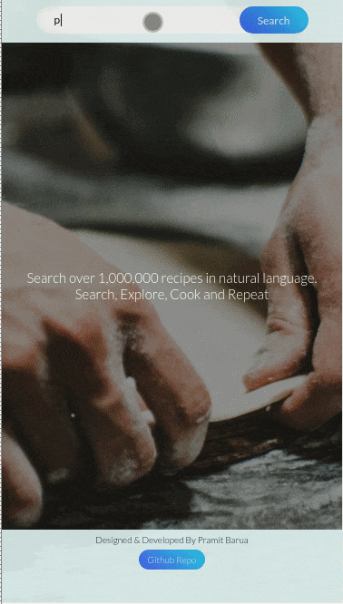

# foodie

Foodie is a recipe search app to find food recipes, ingredients, time, and many more. Check the project demo here
https://pramitbarua.com/project/foodie/

## Description

A React application to search recipes from [the spoonacular API](https://spoonacular.com/food-api)

## Author

Pramit Barua 2020

## Table of Contents

- [About this Project](#about-this-project)
- [Technologies Used](#technologies)
- [What I learned](#what-i-learned)
- [Demo](#demo)

## About this Project

A React application that allows the user to search for recipes. The user will get a detailed description of each step to prepare the food, time requirement, ingredient list, etc.

## Technologies Used

- React
- SASS
- redux
- jest
- enzyme
- rest API

## What I learned

From this project, I have learned more about how the React library works and the integration process to make calls to a third-party API from my application. I also learned Redux to state management of the app. Software testing such Unit test and integration test using jest and enzyme.

## Demo

## Contact me

If you like my project, you can contact me at <pramit.barua@gmail.com>
